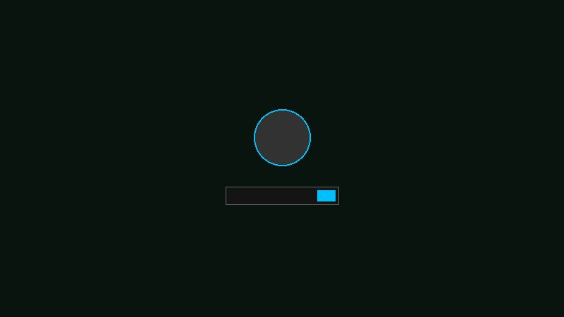

# Halo Cortana - GDM3 Login Screen Theme

Package ini mengubah background login screen (GDM3) di Ubuntu menggunakan background grid radar UNSC Halo Cortana.

## Preview (Pratinjau)

*(Ilustrasi tampilan login screen dengan background baru)*

## Fitur & Perbaikan (Bug Fix)
- Script instalasi kini dilengkapi dengan validasi file dan *error handling* yang lebih baik.
- Terdapat pemberitahuan status jika instalasi berhasil atau gagal.
- Tersedia script `uninstall.sh` khusus agar lebih mudah melakukan reset tanpa perlu mengetik command yang panjang.

## Cara Pemasangan (Instalasi)
Mengubah tema GDM3 di Ubuntu modern membutuhkan ekstraksi file biner `.gresource`. Script instalasi ini melakukannya secara otomatis dan aman.

1. Buka Terminal (`Ctrl`+`Alt`+`T`) di dalam folder hasil ekstraksi ini.
2. Jalankan perintah instalasi:
   ```bash
   sudo ./install.sh
   ```
3. Tunggu hingga proses kompilasi selesai.
4. **Logout** atau **Restart** komputer Anda untuk melihat perubahannya.

## Cara Mengembalikan ke Default (Uninstall)
Jika Anda ingin kembali ke tampilan login bawaan Ubuntu, cukup jalankan script uninstall yang telah disediakan:

1. Buka Terminal di dalam folder ini.
2. Jalankan perintah:
   ```bash
   sudo ./uninstall.sh
   ```
3. Logout atau Restart komputer Anda, dan tampilan login akan kembali seperti semula.
